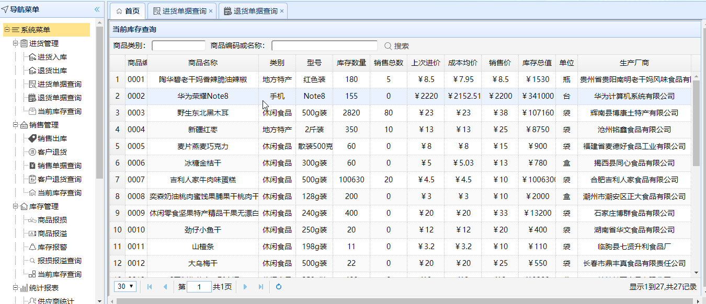
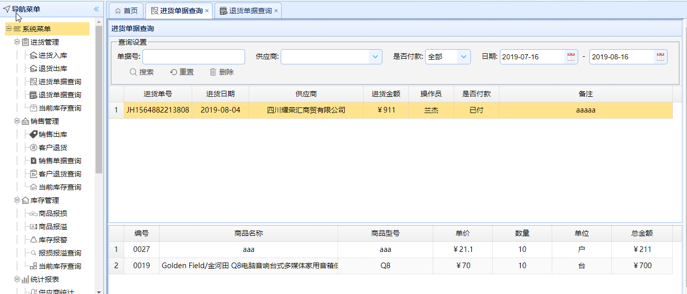
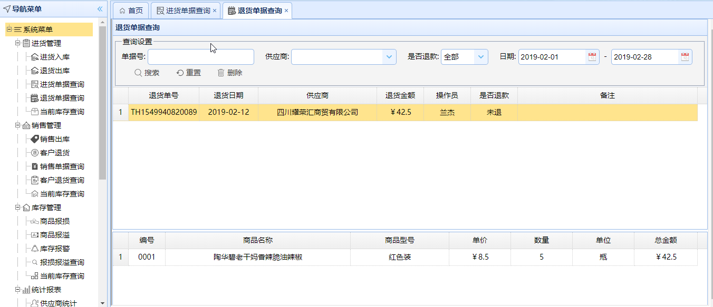
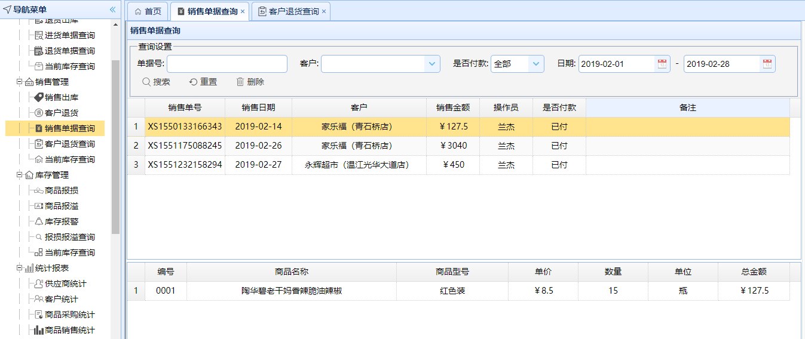
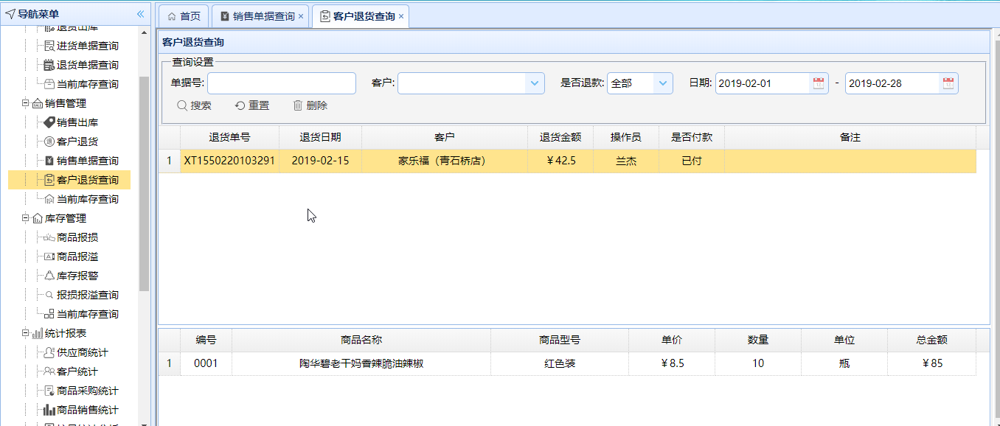
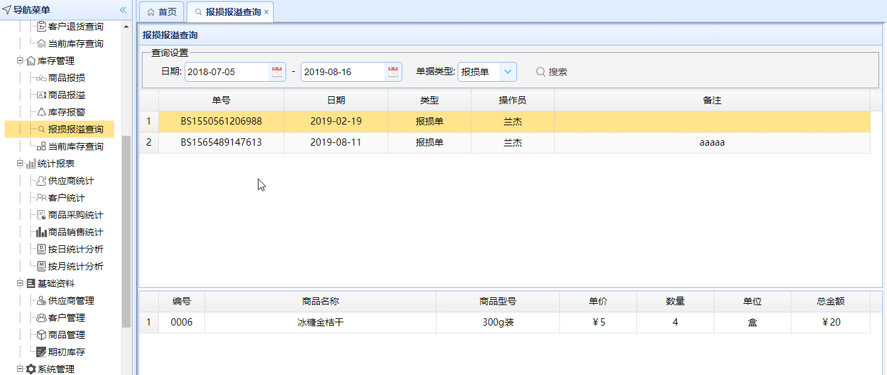
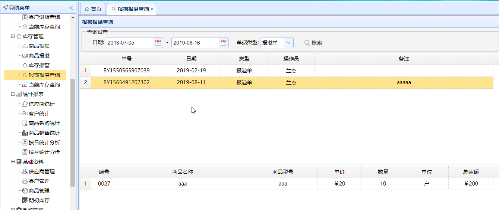
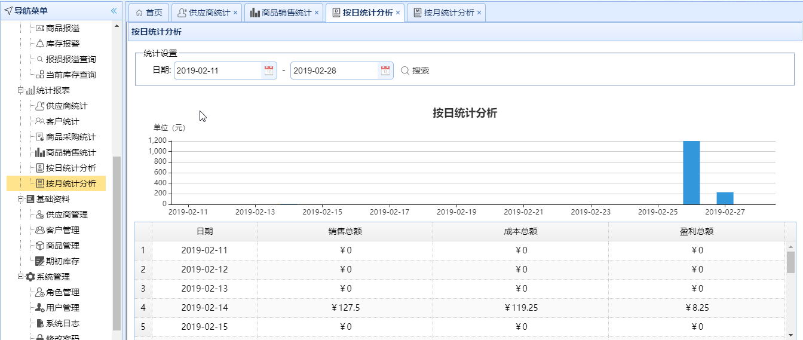
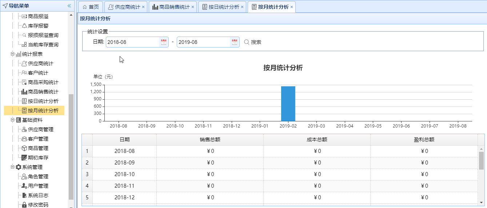
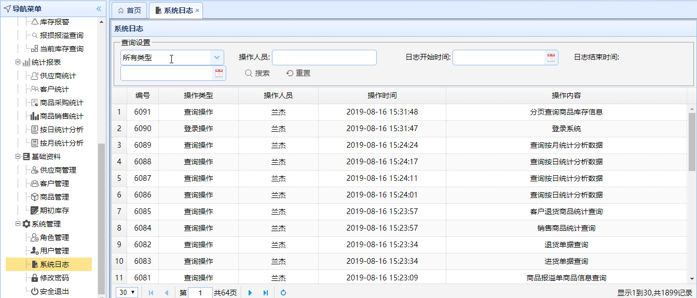

# 企业级进销存管理系统

进销存管理系统，采用SpringBoot+Shiro+MyBatis+EasyUI

项目采用Maven构建，数据库文件存放在 sql/jxc.sql

运行项目部分截图，

登录界面，用户名admin，密码admin123

当前库存查询，

进货单据查询，

退货单据查询，

销售单据查询，

客户退货查询，

报损报溢查询，

按日销售统计、按月销售统计，

系统日志，

